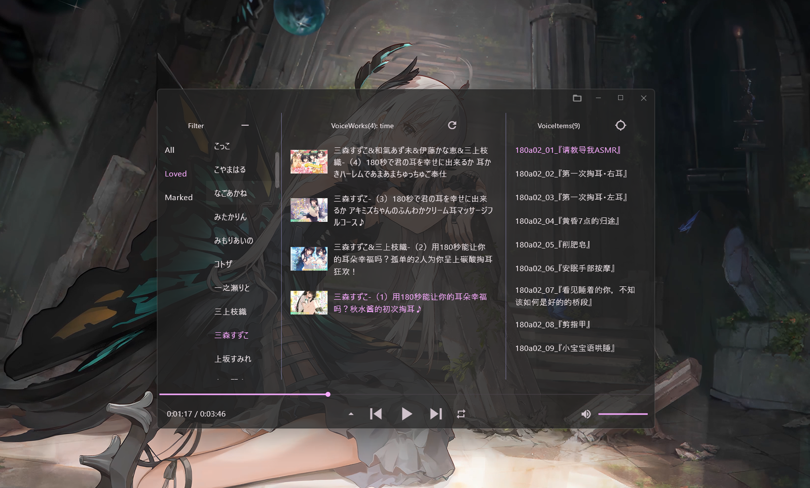
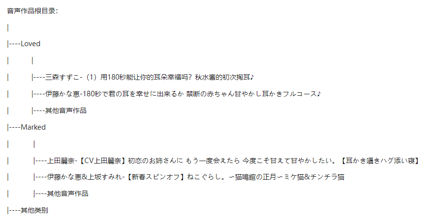
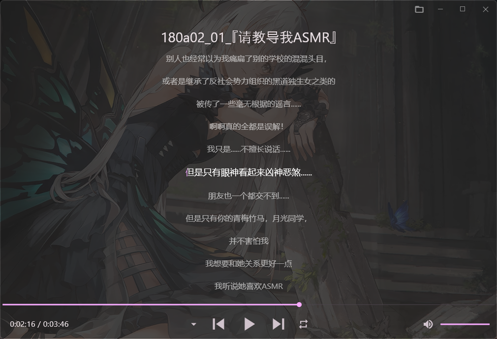
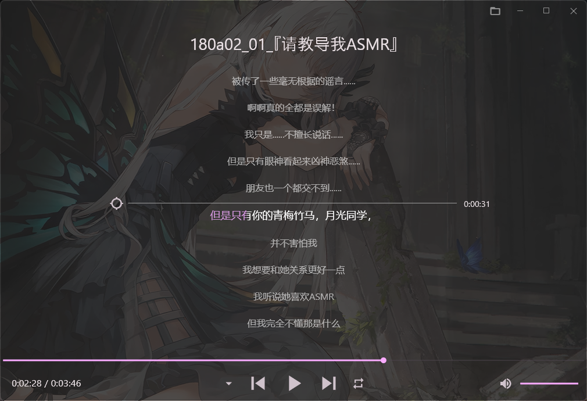

# Again

基于flutter的 本地(Windows)音声播放器。初衷是为了解决音声作品在多级目录下点击麻烦的问题。

<br/>



<br/>

## 介绍

适合于目录层级为音声作品根目录->类别目录->各个作品文件夹，如：



扫描根目录下的所有音声作品，获取类别名称。解析音声作品文件夹名称“cv1&cv2&...-title”得到cv和音声作品。

<br/>

## 功能/特色

1. 采用列视图展示音声作品。

   - 第一列：通过类别和cv筛选出音声作品，类别和cv均默认有“All”选项。点击清除按钮将选中类别和cv的“All”选项。  
   - 第二列：筛选出的音声作品。VoiceWorks(作品数量): 排序方式，点击可在按时间倒序和自然排序之前切换。点击刷新按钮重新扫描文件并更新界面，在每次启动应用时会自动刷新。每个音声作品会选择文件夹内的第一张图片作为封面。  
   - 第三列：音声作品内容。VoiceItems(track数量)，默认自然排序，点击会打开文件在资源管理器中的位置。点击定位按钮会定位到正在播放的track。  
2. 整体界面使用window transparency effects
3. 点击底栏上三角进入歌词界面  



   - 扫描并加载与播放track名称相同lrc文件
   - 点击标题会打开文件在资源管理器中的位置
   - 可拖拽或用滚轮调整歌词位置，点击中间指示线右边的进度即可从选中位置开始播放；点击左边的地位按钮可跳转到正在播放的位置。
   - 点击底栏下三角回到主界面

4. 点击右上角文件夹按钮选择音声作品根目录
5. 退出应用自动保存进度，再次打开恢复上次播放内容

## dev

drift code generator

```text
dart run build_runner build
dart run build_runner watch
```