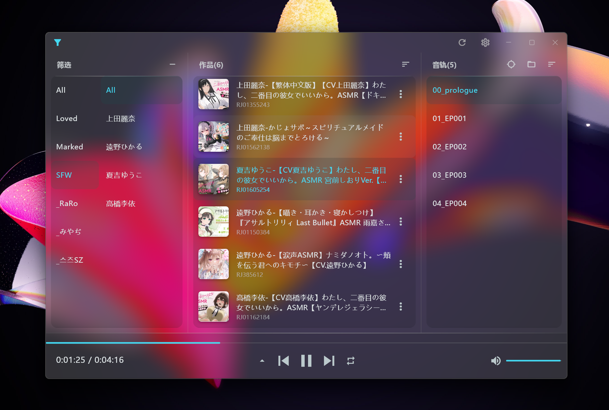
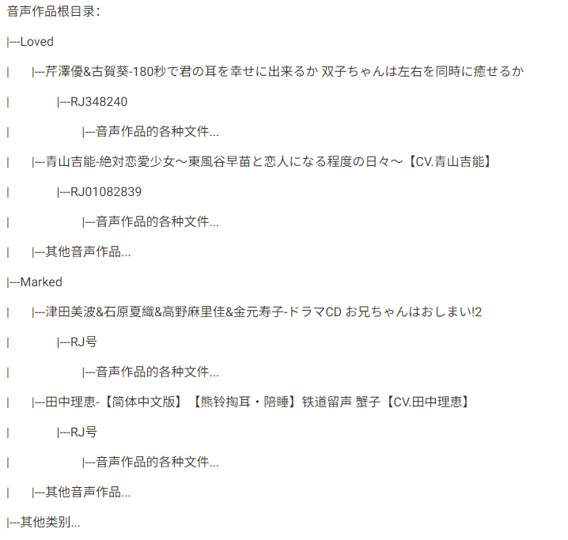
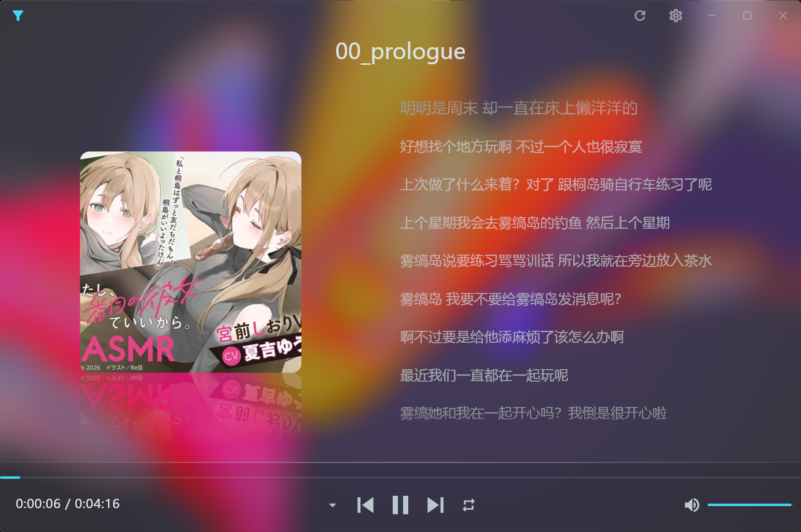
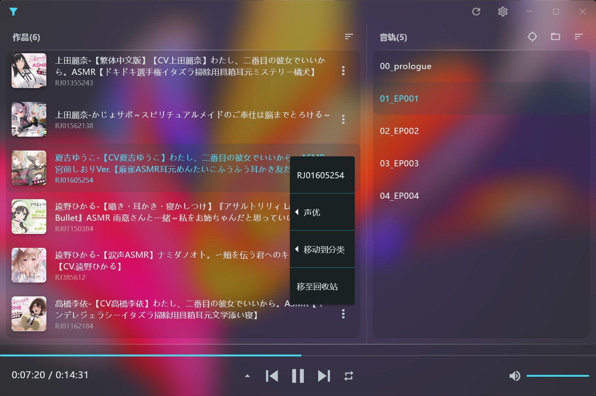

# Again

基于 Flutter 的 Windows 音声播放器。为解决音声作品在多级目录下点击麻烦而制作的小工具。

## 使用前提

你需要满足特定的文件结构要求才能正常使用这个播放工具：

1. **层级结构**：音声作品根目录 > 类别目录 > 各个作品文件夹 > sourceId > 音声作品的各种文件：

   

2. 音声作品**文件夹命名要求**：`cv1&cv2&...&cvN-title`

   比如，cv 有两人"芹澤優"、"古賀葵"，音声作品名称是"180秒で君の耳を幸せに出来る？双子ちゃんは左右を同時に癒せるか"，那么文件夹标题："芹澤優&古賀葵-180秒で君の耳を幸せに出来る？双子ちゃんは左右を同時に癒せるか"。

   你可以手动命名，也可以尝试另一个下载工具 [zDll233/AsmrDownloader](https://github.com/zDll233/AsmrDownloader)，会自动完成命名。

3. sourceId 目录：这个不是必要的。应用会读取音声作品文件夹中的第一个子目录的名称作为 sourceId（一般是 RJ 号）。

首次使用或点击刷新按钮会扫描根目录下的所有音声作品，获取类别名称、音声作品文件夹名称和音声作品。应用会扫描音声作品文件夹中的第一张图片作为封面。

可在设置界面重新选择音声作品根目录。

## 功能/特色

1. **整体界面**：采用列视图展示音声作品。
   - 第一列：筛选面板，面板可折叠展开、通过类别和 cv 筛选出音声作品、重置筛选、搜索框（设置中可打开）支持罗马音。
   - 第二列：筛选出的音声作品面板，可切换排序方式、点击封面查看大图、点击右边三点打开更多菜单选项。
   - 第三列：音轨面板，可打开相应音声文件夹、定位到正在播放的作品、切换排序。

   使用 window transparency/acrylic effects（[flutter_acrylic](https://pub.dev/packages/flutter_acrylic)）。

2. **歌词界面**（[zDll233/flutter_lyric](https://github.com/zDll233/flutter_lyric)，fork 自 [ozyl/flutter_lyric](https://github.com/ozyl/flutter_lyric)）：
   - 支持音频文件同目录下的同名 lrc 或 webvtt 歌词文件（以类似 `.mp3.lrc`、`.wav.vtt` 结尾形式）。
   - 点击下方小三角按钮来打开或关闭歌词界面。
   - 封面的倾斜动画参考了椒盐音乐。

   

3. **局内快捷键**：
   - 空格：播放/暂停
   - ←，→：播放进度控制
   - ↑，↓：音量控制
   - ctrl + ←，ctrl + →：上一曲/下一曲
   - ctrl + ↑，ctrl + ↓：打开/关闭歌词界面
   - 歌词界面点击右键：歌词滚动到当前播放位置
   - 进度条可用鼠标中键滚动调节

4. **音声作品文件夹的快捷操作**：

   点击右方  可弹出菜单：

   1. 复制 sourceId
   2. 筛选选中 cv 的作品
   3. 移动音声文件夹到其他类别目录
   4. 移动音声文件夹到回收站

   

5. **检查更新**：设置页可检查 GitHub Release 新版本并一键更新（下载、解压覆盖、自动重启）。

## 开发

- Windows-only（flutter_acrylic / window_manager / audioplayers）
- 构建：`flutter build windows --release --dart-define=APP_VERSION=<版本号>`
- 测试：`flutter test`
