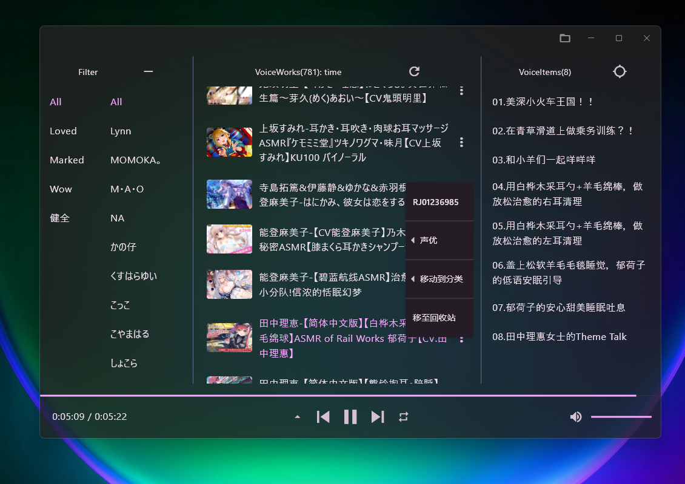

# Again

基于flutter的本地(Windows)音声播放器。为了解决音声作品在多级目录下点击麻烦而制作的小工具。

​​

## 使用前提

你需要满足特定的文件结构要求才能正常使用这个播放工具。

1. **层级结构，** 适合于目录层级为音声作品根目录->类别目录->各个作品文件夹->sourceId->音声作品的各种文件：  
    ​​
2. 音声作品**文件夹命名要求：** “cv1&cv2&...&cvN-title”  
    比如，cv有两人“芹澤優”、“古賀葵”，音声作品名称是“180秒で君の耳を幸せに出来るか 双子ちゃんは左右を同時に癒せるか”，那么文件夹标题：“芹澤優&古賀葵-180秒で君の耳を幸せに出来るか 双子ちゃんは左右を同時に癒せるか”。

    你可以手动命名，也可以尝试另一个下载工具[zDll233/AsmrDownloader](https://github.com/zDll233/AsmrDownloader)，会自动完成命名。
3. *sourceId目录：这个不是必要的。应用会读取音声作品文件夹中的第一个子目录的名称作为sourceId，若不是合法的sourceId，你就不能在[音声作品文件夹的快捷操作](siyuan://blocks/20241130153113-n2hhlxk)里复制sourceId了。

‍

首次使用或点击刷新按钮会扫描根目录下的所有音声作品，获取类别名称，音声作品文件夹名称和音声作品。

点击顶部可重新选择并扫描音声作品根目录。

应用会扫描音声作品文件夹中的第一张图片作为封面。

## 功能/特色

1. **整体界面：** 采用列视图展示音声作品。  
    第一列：通过类别和cv筛选出音声作品，点击上方清除按钮重置筛选条件；  
    第二列：筛选出的音声作品，可点击上方`VoiceWorks`​按钮切换排序方式按时间倒序，按名称顺序；  
    第三列：音声作品内容，点击上方`VoiceItems`​按钮打开相应音声文件夹，点击上方定位按钮定位到正在播放的作品。

    使用window transparency effects（[flutter_lyric | Flutter package](https://pub.dev/packages/flutter_lyric)）。
2. **歌词界面**（[zDll233/flutter_lyric: 用于展示歌词的flutter小部件](https://github.com/zDll233/flutter_lyric)，在[ozyl/flutter_lyric: 用于展示歌词的flutter小部件](https://github.com/ozyl/flutter_lyric)上稍作改动而来）：  
    点击小三角按钮来打开或关闭歌词界面。  
    指示线左边按钮可定位到播放位置，右边按钮跳转到目标进度。  
    ​​

4. **快捷键**：

    空格：播放/暂停  
    ←，→：播放进度控制  
    ↑，↓：音量控制  
    ctrl + ←，ctrl + →：上/下一首  
    ctrl + ↑，ctrl + ↓：打开/关闭歌词界面  
    歌词界面点击右键：定位到当前播放位置
5. 退出前记忆播放位置
6. 对于音声作品文件夹的快捷操作  
    点击右方 可弹出菜单：1. 复制sourceId；2. 筛选选中cv的作品；3. 移动音声文件夹到其他类别目录；4. 移动音声文件夹到回收站。

    ​​

## 构建与开发

```powershell
flutter pub get
flutter build windows
```

‍

drift code generate

```powershell
dart run build_runner build
dart run build_runner watch
```

‍
